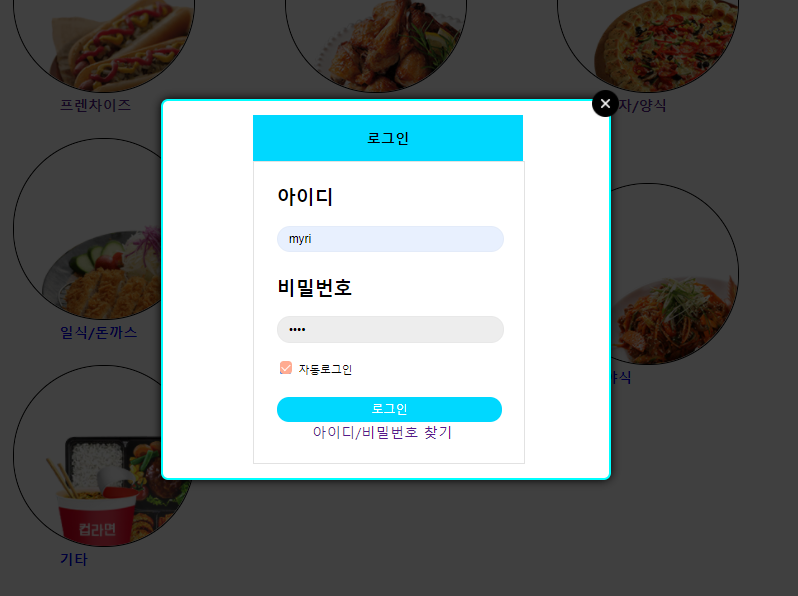
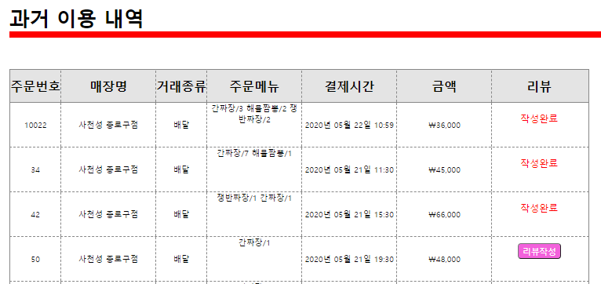

# Project 주문이요 🍕

✔ 음식/좌석 예약 웹 서비스

✔  개발기간 : 2020.04.13 ~ 2020.05.18 (1개월)

✔  인원 : 4명

✔  주요기능

	▪ 데이터베이스 내 기본키로 구별하는 방법으로 각 3가지의 이용자로 나뉘어 애플리케이션을 이용할 수 있다 
		
	▪ 관리자 : 소비자,사업자 관리, 1:1문의 답변, 입점관리
		
	▪ 사업자 : 회원가입, 매장 관리, 입점신청
		
	▪ 소비자 : 회원가입, 회원정보수정, 주문, 좌석예약, 1:1문의  

## 담당기능 

    ✅ 자동로그인
  	
    ✅ 회원 관련 CRUD
	
    ✅ 주문내역
        
    ✅ 카카오지도 API (경도,위도 추출)
	
    ✅ 사업자에게 1:1 문의 보내기
	
    ✅ 매장 검색
	
	
## 개발환경 

## 사용도구 / 사용기술 🛠

 

	            
    
## Preview 

	✍ Main
 

    
    👨‍👩‍👧‍👧 회원가입
 

	🔑 로그인

	📝 주문내역

	🖼 카카오지도 API

