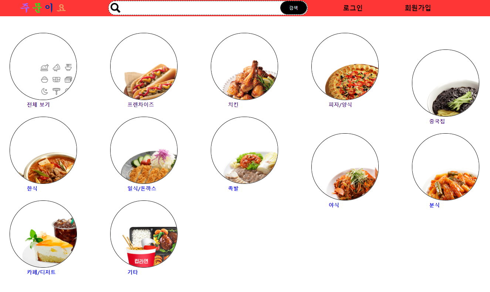

# Project 주문이요

✔ 음식/좌석 예약 웹 서비스

✔  개발기간 : 2020.04.13 ~ 2020.05.18

✔  인원 : 4명

✔  주요기능

	▪ 데이터베이스 내 기본키로 구별하는 방법으로 각 3가지의 이용자로 나뉘어 애플리케이션을 이용할 수 있다 
		
	▪ 관리자 : 소비자,사업자 관리, 1:1문의 답변, 입점관리
		
	▪ 사업자 : 회원가입, 매장 관리, 입점신청
		
	▪ 소비자 : 회원가입, 회원정보수정, 주문, 좌석예약, 1:1문의  

# Use Technology

✔  담당기능 

        ▪ 자동로그인
  
        ▪ 회원가입

        ▪ 회원정보 수정
    
        ▪ 아이디/비밀번호 찾기
        
        ▪ 다음지도 API
✔ 개발환경 

         ▪ Window10

✔ 사용도구 

          ▪ Eclipse
  
          ▪ SqlDeveloper

✔ 사용기술

         ▪ Spring Framework

         ▪ JSP 
 
         ▪ Oracle11g
         
         ▪ TomCat8.5
         
         ▪ HTML5
  
         ▪ CSS3
             
         
    
# Preview 

	✍ Main
 

    
    🤝 회원가입
 

    🖼 다음지도 API

